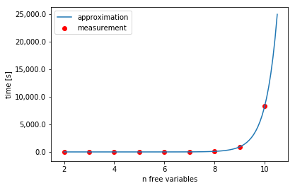

# Runtime Measurements
The example from the Readme-File was run on the test system for 21.5 hours before being manually canceled. To better approximate a theoretical runtime for it, we will perform several tests with increasing numbers of free variables (= freely choosable fields in a 9x9 sudoku) and analyze the results.

## Test setup
### Environment
- Intel(R) Core(TM) i7-2600K CPU @ 3.40GHz
- Fedora 26

### Example Sudoku


source: <http://www.dailysudoku.com/sudoku/archive/2017/10/2017-10-25_solution.shtml>

## Measurements

The free variables up until 9 have been chosen such that on every row, column and 3x3 block of the Sudoku, there is at most one free variable. For a human, this would be trivial to solve by just looking at either a row, a column or a block and identifying the missing digit.

- complete Sudoku check
```prolog
sudoku(3, 7, 4, 6, 9, 2, 5, 8, 1,
       5, 6, 2, 8, 4, 1, 9, 3, 7,
       8, 1, 9, 3, 5, 7, 6, 4, 2,
       9, 2, 8, 5, 1, 6, 3, 7, 4,
       4, 3, 1, 9, 7, 8, 2, 6, 5,
       6, 5, 7, 4, 2, 3, 8, 1, 9,
       1, 8, 5, 2, 3, 4, 7, 9, 6,
       2, 4, 3, 7, 6, 9, 1, 5, 8,
       7, 9, 6, 1, 8, 5, 4, 2, 3).
true .
```

- 2 free variables
```prolog
time(sudoku(A1, 7, 4, 6, 9, 2, 5, 8, 1,
       5, 6, 2, 8, 4, 1, 9, 3, 7,
       8, 1, 9, 3, 5, 7, 6, 4, 2,
       9, 2, 8, 5, 1, 6, 3, 7, 4,
       4, 3, 1, 9, 7, 8, 2, 6, 5,
       6, 5, 7, 4, 2, 3, 8, 1, 9,
       1, 8, 5, 2, 3, 4, 7, 9, 6,
       2, 4, 3, 7, 6, 9, 1, 5, 8,
       7, 9, 6, 1, 8, 5, 4, 2, I9)).
% 36,121 inferences, 0.004 CPU in 0.004 seconds (98% CPU, 8428783 Lips)
```

- 3 free variables
```prolog
time(sudoku(A1, 7, 4, 6, 9, 2, 5, 8, 1,
             5, 6, 2, 8, 4, 1, 9, 3, 7,
             8, 1, 9, 3, 5, 7, 6, 4, 2,
             9, 2, 8, 5, 1, 6, 3, 7, 4,
             4, 3, 1, 9, E5, 8, 2, 6, 5,
             6, 5, 7, 4, 2, 3, 8, 1, 9,
             1, 8, 5, 2, 3, 4, 7, 9, 6,
             2, 4, 3, 7, 6, 9, 1, 5, 8,
             7, 9, 6, 1, 8, 5, 4, 2, I9)).
% 137,286 inferences, 0.012 CPU in 0.012 seconds (99% CPU, 11337571 Lips)
```

- 4 free variables
```prolog
time(sudoku(A1, 7, 4, 6, 9, 2, 5, 8, 1,
             5, 6, 2, 8, 4, 1, 9, 3, 7,
             8, 1, 9, 3, 5, 7, 6, 4, 2,
             9, 2, 8, 5, 1, 6, 3, 7, 4,
             4, 3, 1, 9, E5, 8, 2, 6, 5,
             6, 5, 7, 4, 2, 3, 8, 1, 9,
             1, 8, 5, 2, 3, 4, 7, 9, 6,
             2, H2, 3, 7, 6, 9, 1, 5, 8,
             7, 9, 6, 1, 8, 5, 4, 2, I9)).
% 1,148,784 inferences, 0.064 CPU in 0.064 seconds (100% CPU, 17943826 Lips)
```

- 5 free variables
```prolog
time(sudoku(A1, 7, 4, 6, 9, 2, 5, 8, 1,
             5, 6, 2, 8, 4, 1, 9, B8, 7,
             8, 1, 9, 3, 5, 7, 6, 4, 2,
             9, 2, 8, 5, 1, 6, 3, 7, 4,
             4, 3, 1, 9, E5, 8, 2, 6, 5,
             6, 5, 7, 4, 2, 3, 8, 1, 9,
             1, 8, 5, 2, 3, 4, 7, 9, 6,
             2, H2, 3, 7, 6, 9, 1, 5, 8,
             7, 9, 6, 1, 8, 5, 4, 2, I9)).
% 3,079,743 inferences, 0.187 CPU in 0.187 seconds (100% CPU, 16508537 Lips)
```

- 6 free variables
```prolog
time(sudoku(A1, 7, 4, 6, 9, 2, 5, 8, 1,
             5, 6, 2, 8, 4, 1, 9, B8, 7,
             8, 1, 9, 3, 5, 7, 6, 4, 2,
             9, 2, D3, 5, 1, 6, 3, 7, 4,
             4, 3, 1, 9, E5, 8, 2, 6, 5,
             6, 5, 7, 4, 2, 3, 8, 1, 9,
             1, 8, 5, 2, 3, 4, 7, 9, 6,
             2, H2, 3, 7, 6, 9, 1, 5, 8,
             7, 9, 6, 1, 8, 5, 4, 2, I9)).
% 26,909,460 inferences, 1.537 CPU in 1.539 seconds (100% CPU, 17504755 Lips)
```

- 7 free variables
```prolog
time(sudoku(A1, 7, 4, 6, 9, 2, 5, 8, 1,
             5, 6, 2, 8, 4, 1, 9, B8, 7,
             8, 1, 9, 3, 5, 7, 6, 4, 2,
             9, 2, D3, 5, 1, 6, 3, 7, 4,
             4, 3, 1, 9, E5, 8, 2, 6, 5,
             6, 5, 7, 4, 2, 3, F7, 1, 9,
             1, 8, 5, 2, 3, 4, 7, 9, 6,
             2, H2, 3, 7, 6, 9, 1, 5, 8,
             7, 9, 6, 1, 8, 5, 4, 2, I9)).
% 242,217,066 inferences, 13.803 CPU in 13.822 seconds (100% CPU, 17548180 Lips)
```

- 8 free variables
```prolog
time(sudoku(A1, 7, 4, 6, 9, 2, 5, 8, 1,
             5, 6, 2, 8, 4, 1, 9, B8, 7,
             8, 1, 9, C4, 5, 7, 6, 4, 2,
             9, 2, D3, 5, 1, 6, 3, 7, 4,
             4, 3, 1, 9, E5, 8, 2, 6, 5,
             6, 5, 7, 4, 2, 3, F7, 1, 9,
             1, 8, 5, 2, 3, 4, 7, 9, 6,
             2, H2, 3, 7, 6, 9, 1, 5, 8,
             7, 9, 6, 1, 8, 5, 4, 2, I9)).
% 1,684,796,772 inferences, 101.873 CPU in 102.002 seconds (100% CPU, 16538191 Lips)
```

- 9 free variables
```prolog
time(sudoku(A1, 7, 4, 6, 9, 2, 5, 8, 1,
             5, 6, 2, 8, 4, 1, 9, B8, 7,
             8, 1, 9, C4, 5, 7, 6, 4, 2,
             9, 2, D3, 5, 1, 6, 3, 7, 4,
             4, 3, 1, 9, E5, 8, 2, 6, 5,
             6, 5, 7, 4, 2, 3, F7, 1, 9,
             1, 8, 5, 2, 3, G6, 7, 9, 6,
             2, H2, 3, 7, 6, 9, 1, 5, 8,
             7, 9, 6, 1, 8, 5, 4, 2, I9)).
% 15,133,049,151 inferences, 912.366 CPU in 913.484 seconds (100% CPU, 16586593 Lips)
```
- 10 free variables
    - Now, not all free variables can be "independent"
```prolog
time(sudoku(A1, 7, 4, 6, 9, 2, 5, 8, 1,
             5, 6, 2, 8, 4, 1, 9, B8, 7,
             8, 1, 9, C4, 5, 7, 6, 4, 2,
             9, 2, D3, 5, 1, 6, 3, 7, 4,
             E1, 3, 1, 9, E5, 8, 2, 6, 5,
             6, 5, 7, 4, 2, 3, F7, 1, 9,
             1, 8, 5, 2, 3, G6, 7, 9, 6,
             2, H2, 3, 7, 6, 9, 1, 5, 8,
             7, 9, 6, 1, 8, 5, 4, 2, I9)).
% 135,793,811,262 inferences, 8318.733 CPU in 8328.944 seconds (100% CPU, 16323858 Lips)
```

### Alternative Measurement
When we measure a Sudoku where the free variables are diagonal, the result gets worse. This just shows that the approach with "independent" variables (max. 9 free variables) could be considered a "best-case", and it is hard to extrapolate further.

```prolog
time(sudoku(A1, 7, 4, 6, 9, 2, 5, 8, 1,
       5, B2, 2, 8, 4, 1, 9, 3, 7,
       8, 1, C3, 3, 5, 7, 6, 4, 2,
       9, 2, 8, D4, 1, 6, 3, 7, 4,
       4, 3, 1, 9, E5, 8, 2, 6, 5,
       6, 5, 7, 4, 2, F6, 8, 1, 9,
       1, 8, 5, 2, 3, 4, G7, 9, 6,
       2, 4, 3, 7, 6, 9, 1, H8, 8,
       7, 9, 6, 1, 8, 5, 4, 2, I9)).
% 23,733,114,880 inferences, 1345.532 CPU in 1347.221 seconds (100% CPU, 17638464 Lips)
```

## Results
| x   | t [s]  |
| --- | ------ |
| 2   | 0.004  |
| 3   | 0.012  |
| 4   | 0.064  |
| 5   | 0.19   |
| 6   | 1.54   |
| 7   | 13.82  |
| 8   | 102    |
| 9   | 913.48 |
| 10  | 8328.9 |

As we can see in the [Measurement Analysis](measurement_analysis.ipynb), the time explodes exponentially. With a exponential curve fit, we see that 12 free variables would approximately take over a week, although it is hard to extrapolate from this small dataset.


| x  | approximate runtime |
|----|---------------------|
| 11 | 20.8 hours          |
| 12 | 7.8 days            |
| 13 | 2.35 months         |
| 14 | 21.2 months         |
| 15 | 16.1 years          |


